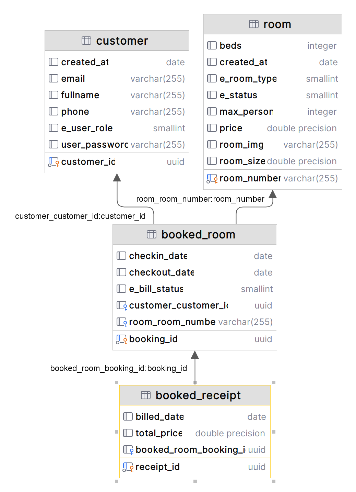
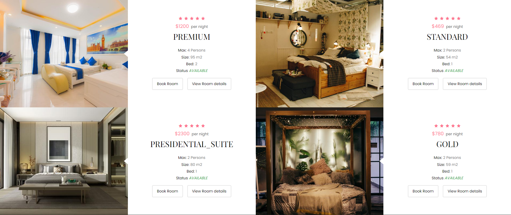

## THIERRY MUGISHA, 24300.
## WEB TECHNOLOGIES AND INTERNET FINAL PROJECT
<hr/>

## SWEET DREAMS HOTEL
## ```Stay, sleep, enjoy and have best nights with endless Sweet dreams.```

## Summary
Customers will be able to book a room online and get confirmation, Or book on site.
Hotel staff will be able to manage hotel rooms, and booked rooms.
Execution Strategy
Customers will first visit our website view available rooms, then proceed to book room.
Before booking room they will need to enter their information which will help them to login
and track their booked room status.
After booking they receive a notification email confirming the booking, the staff see the new
booking information and customer information.
At the end staff will be able to check out or even cancel.


## Technical/Project Approach
Staff will insert rooms information:
- Room number
- Room type
- Room image
- Maximum person
- Beds in room
- Room size
- Price

Status
  For the status when the room is created its set to “available”.
  For room images I am using S3 bucket from amazon and I save URL into the database,
  because saving blob will make my database heavy and it’s not a best practice.
  I will display all rooms whether taken or not, but I will put label on them (taken/available)
  when it’s taken book button is hidden.
  When they want to book a room they first provide their information, name, email, phone.
  But it’s only once next time they just login and book.
  They will track their booked room status. And each customer can view only their information,
  but staff can see for all customers.
  Also Staff can book room for a customer, bill and cancel the customer is included.
  I will display booked room in categories
- Non billed (Still taken)
- Billed (Not taken)
- Cancelled (Not taken)
  When the room is booked the status change to taken and vice versa.

  ## Diagram
  <hr/>
  
  
  ## Tools used
  Spring Boot for building API
  React for a better UI/UX and reuse of components
  PostgreSql as DBMS
  Hosting provider: render, hosting both backend and database.

  ## Thierry MUGISHA, 24300.

  ``Screenshot``

  